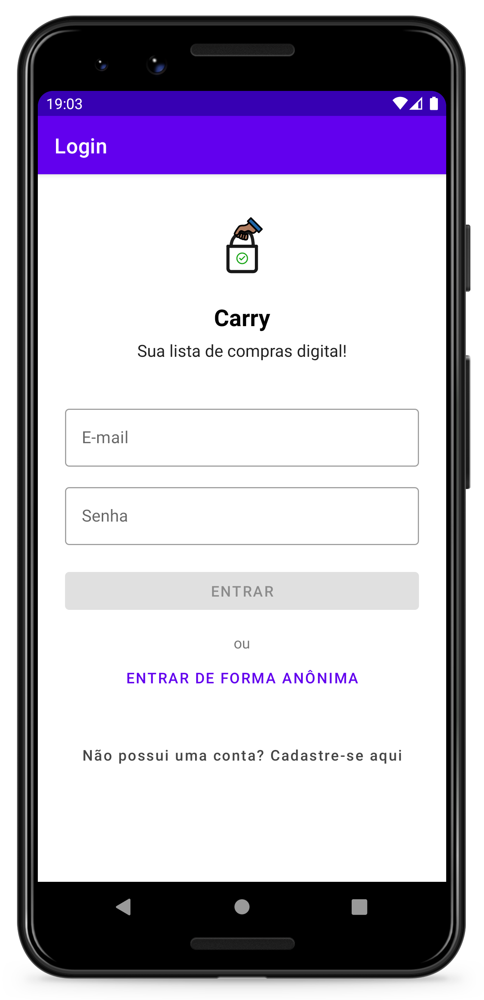
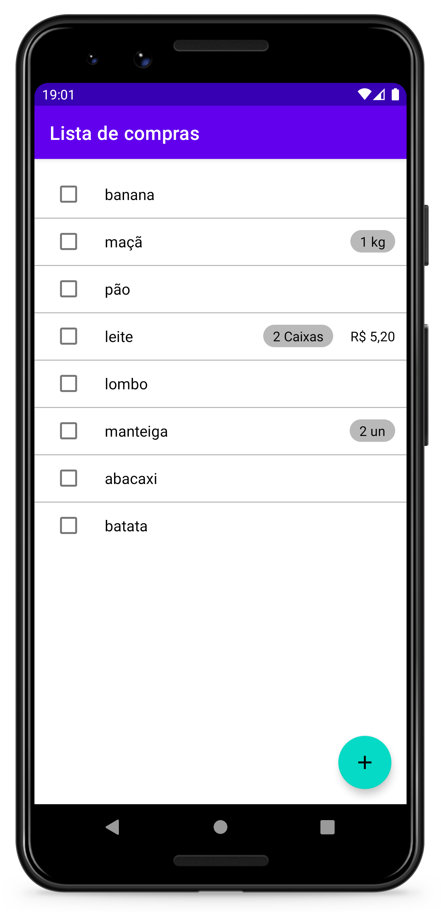
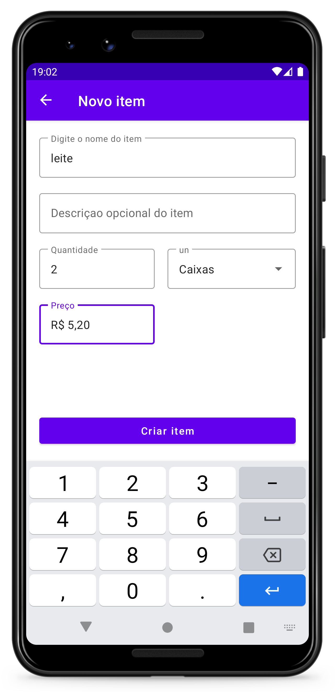
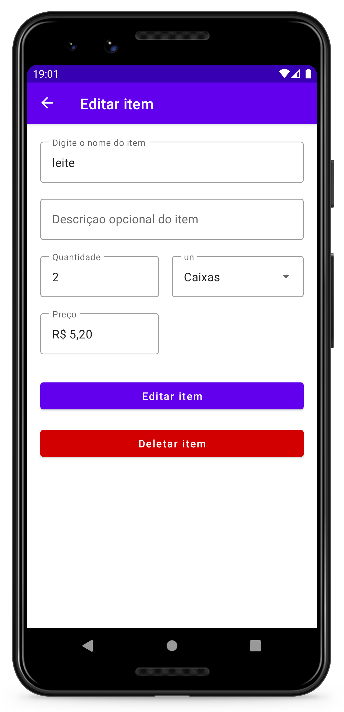

<h1 align="center">Carry</h1>

Aplicativo de lista de compras feito usando Kotlin

  

<h2 align="center">App showcase</h2>

 

  
  
  
  

 

## :monocle_face: Sobre o projeto 

Projeto de lista de compras, desenvolvido para aprender desenvolvimento Android nativo.
